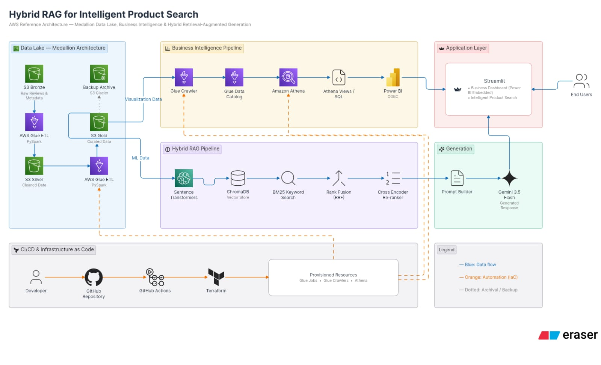

# Amazon Review Analytics Platform

An end-to-end **Hybrid RAG-based Intelligent Product Search Platform** built using Amazon Product Metadata and Customer Review data.

The project combines **Big Data Engineering, NLP, Semantic Search, Keyword Search, Hybrid Retrieval, Re-ranking, Generative AI, Business Intelligence, and AWS Cloud Infrastructure** to provide users with a more intelligent way to search and understand products.

---

## Overview

When users shop on e-commerce platforms, they typically search for products, apply filters such as category, price, and rating, and manually browse multiple products.

They often need to:

- Compare multiple products
- Read customer reviews individually
- Identify positive and negative feedback
- Understand product quality
- Compare ratings and customer experiences
- Decide which product best matches their requirements

Our project addresses this problem by building an **Intelligent Product Search system** that combines product information and customer reviews with Hybrid RAG.

Instead of relying on only semantic search or keyword search, our system combines both approaches and applies **Reciprocal Rank Fusion (RRF)** and **Cross-Encoder Re-ranking** before generating the final response using **Google Gemini**.

The project also includes a **Power BI Business Intelligence layer** to analyze product performance, review activity, ratings, and customer engagement patterns.

---

## Problem Statement

Traditional e-commerce product search requires users to manually browse and analyze multiple products and their reviews.

Even after applying filters such as rating or category, users may still need to:

1. Open multiple product pages
2. Read numerous customer reviews
3. Identify common positive and negative feedback
4. Compare products manually
5. Decide which product is most relevant to their requirements

### Our Objective

Build an intelligent product search system that can:

- Understand the semantic meaning of user queries
- Match exact product-specific keywords
- Retrieve relevant product information
- Combine semantic and lexical retrieval
- Re-rank the retrieved results
- Use customer review information as supporting context
- Generate a concise, context-grounded response

---

## Solution

Our solution uses a **Hybrid Retrieval-Augmented Generation (RAG)** architecture.

The system combines:

```text
Semantic Search
      +
Keyword Search
      ↓
Hybrid Retrieval
      ↓
RRF Fusion
      ↓
Cross-Encoder Re-ranking
      ↓
Relevant Context
      ↓
Gemini
      ↓
Intelligent Response
```

This allows the system to benefit from both:

- **Semantic understanding**
- **Exact keyword matching**

---

## Architecture

<p align="center">
  
</p>

### Architecture Flow

```text
                          AMAZON PRODUCT & REVIEW DATA
                                      |
                                      v
                               ┌───────────────┐
                               │   Amazon S3   │
                               │   Bronze      │
                               └───────┬───────┘
                                       |
                                       v
                               ┌───────────────┐
                               │ AWS Glue +    │
                               │ PySpark ETL   │
                               └───────┬───────┘
                                       |
                                       v
                               ┌───────────────┐
                               │  S3 Silver    │
                               │ Cleaned Data  │
                               └───────┬───────┘
                                       |
                                       v
                               ┌───────────────┐
                               │  S3 Gold      │
                               │ Curated Data  │
                               └───────┬───────┘
                                       |
                      ┌────────────────┴────────────────┐
                      |                                 |
                      v                                 v
              BUSINESS INTELLIGENCE                HYBRID RAG
                      |                                 |
                      v                                 v
               Glue Crawler                    Product Documents
                      |                                 |
                      v                                 v
               Glue Data Catalog                    Chunking
                      |                                 |
                      v                                 v
                  Athena                         Embeddings
                      |                                 |
                      v                      ┌──────────┴──────────┐
               Athena Views                  |                     |
                      |                      v                     v
                      v                  ChromaDB                BM25
                   Power BI             Semantic Search       Keyword Search
                      |                      |                     |
                      |                      └─────────┬───────────┘
                      |                                |
                      |                                v
                      |                         RRF Fusion
                      |                                |
                      |                                v
                      |                       Cross-Encoder
                      |                         Re-ranking
                      |                                |
                      |                                v
                      |                         Prompt Builder
                      |                                |
                      |                                v
                      |                         Gemini 3.5 Flash
                      |                                |
                      └────────────────┬───────────────┘
                                       |
                                       v
                                   Streamlit
                                       |
                                       v
                                   End Users
```

---

## Data Lake Architecture

The project follows a **Medallion Architecture** using Amazon S3.

```text
Raw Data
   ↓
Bronze
   ↓
Silver
   ↓
Gold
```

### Bronze Layer

The Bronze layer stores the raw Amazon Reviews and Product Metadata data in Amazon S3.

**Purpose:**

- Raw data preservation
- Original data availability
- Reprocessing capability
- Data archival

### Silver Layer

AWS Glue and PySpark are used to clean and transform the Bronze data.

**Processing includes:**

- Data cleaning
- Duplicate handling
- Missing-value treatment
- Schema standardization
- Timestamp transformation
- Nested metadata processing
- Column selection
- Data integration

### Silver Master

Product metadata and customer reviews are integrated using:

```text
parent_asin
```

`parent_asin` acts as the common product-level identifier between product metadata and customer reviews.

The Silver Master provides the common transformed dataset for downstream pipelines.

### Gold Layer

The curated Silver data is used to create two major downstream pipelines:

```text
                    Silver Master
                         |
                   ┌─────┴─────┐
                   |           |
                   v           v
                Gold ML    Gold Visualization
                   |           |
                   v           v
               Hybrid RAG    Power BI
```

---

## Gold ML Pipeline

The Gold ML pipeline prepares product information for the Hybrid RAG system.

```text
Silver Master
     |
     v
Product Documents
     |
     v
Document Truncation
     |
     v
Text Chunking
     |
     v
Sentence Transformers
     |
     v
Embeddings
     |
     v
ChromaDB
```

The final document dataset contains product-level information such as:

```text
parent_asin
category
product_title
document
```

The validated document dataset contains approximately **445K product documents**.

---

## Document Generation

Structured product information is converted into a unified textual representation.

The purpose is to create meaningful text that can be processed by NLP and embedding models.

```text
Structured Product Data
          |
          v
     Document Creation
          |
          v
   Document Length Control
          |
          v
      Final Documents
          |
          v
        Chunking
          |
          v
       Embeddings
```

Document truncation is applied to control excessively large documents and make downstream NLP and embedding processing more efficient.

---

## Embedding Generation

The final product documents and chunks are converted into vector representations using **Sentence Transformers**.

```text
Text Chunk
    |
    v
Sentence Transformer
    |
    v
Embedding Vector
    |
    v
ChromaDB
```

These embeddings capture the semantic meaning of the product information and enable semantic similarity search.

---

## Semantic Retrieval

ChromaDB is used as the vector store for semantic retrieval.

When a user submits a query:

```text
User Query
    ↓
Query Embedding
    ↓
Vector Similarity Search
    ↓
Top-K Semantic Results
```

Semantic retrieval is useful when the query and product information have similar meanings even when they do not contain exactly the same words.

---

## Keyword Retrieval using BM25

In parallel with semantic search, the system performs keyword-based retrieval using **BM25**.

BM25 is particularly useful for:

- Exact product names
- Brand names
- Model numbers
- Technical terms
- Product-specific keywords
- Exact feature requirements

```text
User Query
    ↓
BM25
    ↓
Keyword-Based Results
```

---

## Hybrid Retrieval

The key feature of our retrieval system is the combination of:

```text
Semantic Retrieval
       +
BM25 Keyword Retrieval
       ↓
    RRF Fusion
```

Semantic search provides contextual understanding, while BM25 provides exact keyword matching.

Combining both improves retrieval robustness.

---

## Reciprocal Rank Fusion (RRF)

The results from ChromaDB and BM25 are combined using **Reciprocal Rank Fusion**.

RRF combines rankings from multiple retrieval systems and creates a unified ranking.

```text
ChromaDB Results
       +
BM25 Results
       ↓
RRF Fusion
       ↓
Combined Candidate Set
```

This allows the system to leverage the strengths of both retrieval methods.

---

## Cross-Encoder Re-ranking

After hybrid retrieval, the candidate results are passed through a **Cross-Encoder re-ranker**.

The Cross-Encoder evaluates the relevance between:

```text
User Query
      +
Retrieved Product Document
```

and assigns a relevance score.

```text
Hybrid Results
      ↓
Cross-Encoder
      ↓
Re-ranked Results
      ↓
Top Relevant Context
```

This improves the quality of the context passed to the generation model.

---

## Generative AI

The most relevant retrieved information is passed to a Prompt Builder.

```text
User Query
     +
Retrieved Context
     ↓
Prompt Builder
     ↓
Gemini 3.5 Flash
     ↓
Generated Response
```

Google Gemini 3.5 Flash generates the final response using the retrieved product context.

The objective is to provide responses grounded in the retrieved product information rather than relying solely on the model's general knowledge.

---

## Business Intelligence Pipeline

The project also contains a separate Business Intelligence pipeline.

```text
S3 Gold
   ↓
AWS Glue Crawler
   ↓
Glue Data Catalog
   ↓
Amazon Athena
   ↓
Athena Views / SQL
   ↓
Power BI
```

This layer provides business-level insights into product and review data.

---

## Power BI Analytics

The Power BI dashboard is designed to quickly visualize product and customer review activity.

The dashboard supports analysis such as:

- Product performance
- Review volume
- Average ratings
- Rating distribution
- Verified purchases
- Product categories
- Review trends
- Helpful votes
- Customer sentiment
- Product-level engagement patterns

Power BI provides the analytical perspective:

> **What is happening in our product and review data?**

The Hybrid RAG system addresses the user-facing question:

> **Which product information is relevant to my query, and why?**

---

## Application Layer

The complete solution is exposed through a **Streamlit application**.

The application provides:

### Intelligent Product Search

Users can enter natural-language product queries and receive responses based on the retrieved product information.

### Business Dashboard

The application can also provide access to the Power BI business intelligence layer.

```text
                    Streamlit
                   /          \
                  /            \
                 v              v
        Intelligent Search    Power BI
                |                 |
                v                 v
             Hybrid RAG       Analytics
```

---

## RAG Evaluation

The project includes evaluation of both retrieval quality and generated responses.

### Faithfulness

Measures whether factual claims in the generated response are supported by the retrieved context.

```text
Faithfulness =
Supported Claims / Total Claims × 100
```

### Retrieval Relevance

Measures how many of the Top-K retrieved products are relevant to the user's query.

For Top-5 retrieval:

```text
Retrieval Relevance =
Relevant Products / 5 × 100
```

---

## CI/CD & Infrastructure as Code

The project uses GitHub, GitHub Actions, and Terraform for development automation and infrastructure management.

```text
Developer
    |
    v
GitHub Repository
    |
    v
GitHub Actions
    |
    v
Terraform
    |
    v
AWS Infrastructure
```

### Terraform

Terraform is used for Infrastructure as Code (IaC).

Typical workflow:

```bash
terraform init
terraform plan
terraform apply
```

Terraform helps make cloud infrastructure reproducible and easier to manage.

### GitHub Actions

GitHub Actions supports CI/CD automation including:

- Code quality checks
- Automated testing
- Validation
- Deployment workflows

---

## AWS Services

The project uses the following AWS services:

| Service | Purpose |
| --- | --- |
| Amazon S3 | Data Lake and storage |
| AWS Glue | PySpark ETL and data cataloging |
| AWS Glue Crawler | Schema discovery |
| AWS Glue Data Catalog | Metadata management |
| Amazon Athena | Serverless SQL analytics |
| Amazon S3 Glacier | Backup / archival |
| Terraform | Infrastructure as Code |

---

## Technology Stack

| Category | Technologies |
| --- | --- |
| Programming | Python, SQL |
| Big Data | PySpark |
| Data Engineering | AWS Glue, Databricks |
| Cloud Storage | Amazon S3 |
| Data Format | Apache Parquet, Snappy |
| NLP | Sentence Transformers |
| Vector Store | ChromaDB |
| Keyword Retrieval | BM25 |
| Hybrid Retrieval | RRF |
| Re-ranking | Cross-Encoder |
| Generative AI | Google Gemini |
| Business Intelligence | Power BI |
| Application | Streamlit |
| Infrastructure | Terraform |
| Containerization | Docker |
| Version Control | Git, GitHub |
| CI/CD | GitHub Actions |

---

## Dataset

The project uses the:

**Amazon Reviews 2023 Dataset**

**Source:**

McAuley-Lab Amazon Reviews 2023

**Selected Categories:**

- Appliances
- Musical Instruments
- Sports & Outdoors
- Video Games

The data consists of:

- Product Metadata
- Customer Reviews
- Ratings
- Review Text
- Verified Purchase Information
- Helpful Votes
- Product Information

---

## Project Structure

```text
amazon-review-analytics-platform/
│
├── .github/
│   └── workflows/
│
├── config/
│   └── datasets/
│
├── docs/
│   └── architecture/
│       └── Architecture.jpeg
│
├── gluejobs/
│
├── local-jupyter-notebook-analysis/
│
├── ml_pipeline/
│
├── notebooks/
│
├── scripts/
│
├── src/
│
├── terraform/
│
├── tests/
│
├── .flake8
├── .gitignore
├── LICENSE
├── README.md
├── pyproject.toml
├── requirements.txt
└── requirements-dev.txt
```

---

## Repository Components

### `config/datasets`

Contains dataset configuration and dataset-related definitions used by the processing pipelines.

### `gluejobs`

Contains AWS Glue ETL jobs used for large-scale data processing and transformation.

### `local-jupyter-notebook-analysis`

Contains local Jupyter notebooks used for exploratory data analysis and development.

### `ml_pipeline`

Contains the Machine Learning and Hybrid RAG components:

- Document generation
- Chunking
- Embeddings
- ChromaDB
- BM25
- Hybrid retrieval
- RRF
- Cross-Encoder re-ranking
- Gemini integration
- Evaluation
- Streamlit application

### `notebooks`

Contains notebooks used for analysis, experimentation, validation, and development.

### `scripts`

Contains utility and automation scripts.

### `src`

Contains reusable source code supporting the project's data engineering and ML components.

### `terraform`

Contains Infrastructure-as-Code configurations used to provision and manage AWS resources.

### `tests`

Contains automated tests for project components.

### `.github/workflows`

Contains GitHub Actions workflows for CI/CD and automated validation.

---

## Development

Clone the repository:

```bash
git clone <repository-url>
cd amazon-review-analytics-platform
```

Create a virtual environment:

```bash
python -m venv .venv
```

Activate the environment:

### macOS / Linux

```bash
source .venv/bin/activate
```

### Windows

```bash
.venv\Scripts\activate
```

Install project dependencies:

```bash
pip install -r requirements.txt
```

Install development dependencies:

```bash
pip install -r requirements-dev.txt
```

---

## End-to-End Project Flow

```text
Amazon Reviews + Product Metadata
                |
                v
             Amazon S3
                |
                v
          Bronze Data Layer
                |
                v
         AWS Glue + PySpark
                |
                v
          Silver Data Layer
                |
                v
           Silver Master
                |
          ┌─────┴─────┐
          |           |
          v           v
       Gold ML   Gold Visualization
          |           |
          v           v
      Documents   Athena / Power BI
          |
          v
       Chunking
          |
          v
      Embeddings
          |
       ┌──┴──┐
       |     |
       v     v
   ChromaDB BM25
       |     |
       └──┬──┘
          |
          v
       RRF Fusion
          |
          v
   Cross-Encoder
      Re-ranking
          |
          v
     Prompt Builder
          |
          v
        Gemini
          |
          v
       Streamlit
          |
          v
       End User
```

---

## Key Features

- End-to-end AWS Data Lake architecture
- Bronze-Silver-Gold Medallion architecture
- Large-scale PySpark processing
- Product and review data integration
- NLP-based document generation
- Document length control and truncation
- Text chunking
- Sentence Transformer embeddings
- ChromaDB semantic retrieval
- BM25 keyword retrieval
- Hybrid retrieval
- Reciprocal Rank Fusion
- Cross-Encoder re-ranking
- Gemini-powered response generation
- RAG evaluation
- Power BI business analytics
- Streamlit application
- Terraform Infrastructure as Code
- GitHub Actions CI/CD
- S3 archival and backup

---

## Team

### Group 2

| # | Team Member |
| --- | --- |
| 1 | **Abhijeet Soni** |
| 2 | **Akshata Shivram Gawade** |
| 3 | **Ankit Kumar** |
| 4 | **Kinjal Ramdas Bopte** |
| 5 | **Mohammed Affaan Arbani** |
| 6 | **Sankalp Suresh Deore** |
| 7 | **Shreyash Sanjay Dongare** |
| 8 | **Vishal Deepak Jadhav** |
| 9 | **Yashvardhan Sahu** |

---

## Project Objective

The overall objective of the project is to reduce the effort required by users to search, compare, and understand products by combining:

```text
Big Data
   +
NLP
   +
Semantic Search
   +
Keyword Search
   +
Hybrid Retrieval
   +
Re-ranking
   +
Generative AI
   +
Business Intelligence
```

into a single intelligent product-search platform.

---

## Future Enhancements

Potential future improvements include:

- Advanced query understanding
- Personalized product recommendations
- Multi-category expansion
- Conversational product comparison
- Improved RAG evaluation
- Feedback-driven retrieval optimization
- Real-time product data integration
- Advanced recommendation models
- Production-scale deployment

---

## License

This project was developed for academic and educational purposes.
