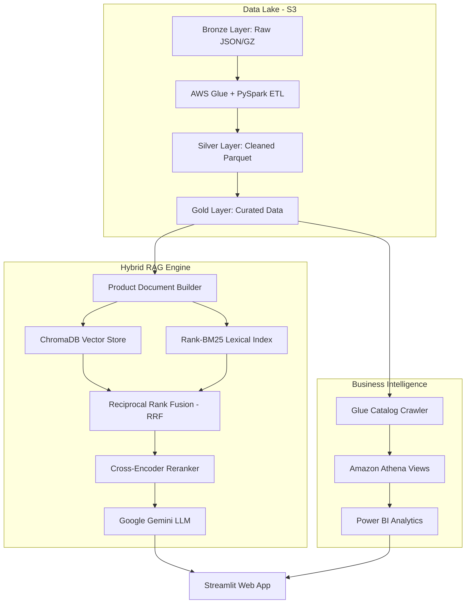

# Architecture Diagram

```mermaid
graph TD
    subgraph Data Lake - S3
        A[Bronze Layer: Raw JSON/GZ] --> B[AWS Glue + PySpark ETL]
        B --> C[Silver Layer: Cleaned Parquet]
        C --> D[Gold Layer: Curated Data]
    end

    subgraph Business Intelligence
        D --> E[Glue Catalog Crawler]
        E --> F[Amazon Athena Views]
        F --> G[Power BI Analytics]
    end

    subgraph Hybrid RAG Engine
        D --> H[Product Document Builder]
        H --> I[ChromaDB Vector Store]
        H --> J[Rank-BM25 Lexical Index]
        I --> K[Reciprocal Rank Fusion - RRF]
        J --> K
        K --> L[Cross-Encoder Reranker]
        L --> M[Google Gemini LLM]
    end

    M --> N[Streamlit Web App]
    G --> N
```
