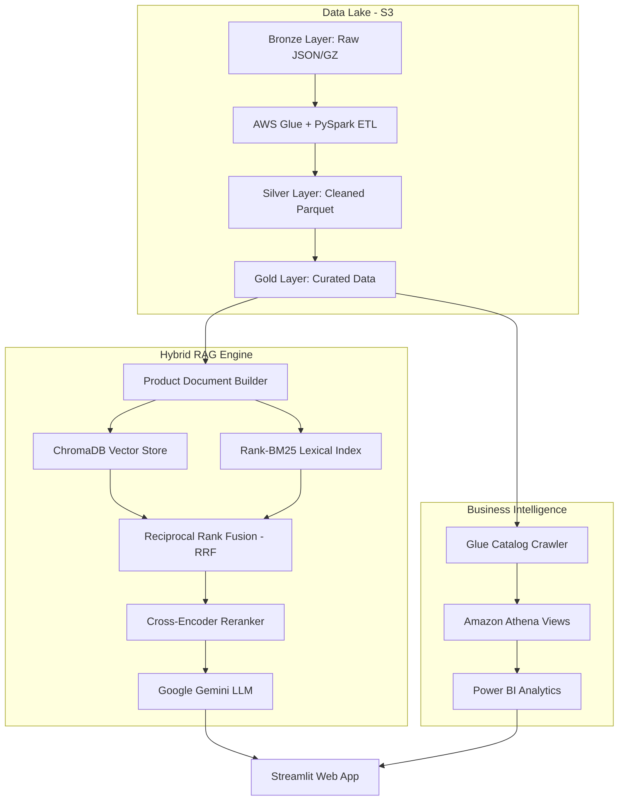

# Architecture Diagram

## Purpose
Provides a visual Mermaid flowchart representing the Amazon Review Analytics Platform end-to-end layered architecture.

## Related Files
- [01 Architecture](../01_ARCHITECTURE.md)
- [06 AWS Infrastructure](../06_AWS_INFRASTRUCTURE.md)
- [08 ML Pipeline](../08_ML_PIPELINE.md)

## Key Concepts
- **Layer Separation**: Unidirectional flow from raw S3 ingestion to distributed Glue PySpark ETL, hybrid ML retrieval, Gemini LLM synthesis, and Streamlit frontend UI.

## Content

## Next Reading
- [01 Architecture](../01_ARCHITECTURE.md)
