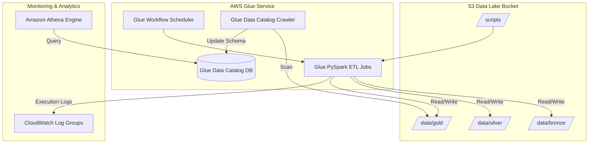

# AWS Infrastructure Diagram

## Purpose
Provides a visual Mermaid graph detailing managed AWS infrastructure components and connections.

## Related Files
- [06 AWS Infrastructure](../06_AWS_INFRASTRUCTURE.md)
- [10 Terraform](../10_TERRAFORM.md)

## Key Concepts
- **AWS Cloud Topology**: Integration of S3 Data Lake buckets, Glue Workflows/Jobs/Crawlers, Glue Data Catalog, Athena, and CloudWatch.

## Content

## Next Reading
- [06 AWS Infrastructure](../06_AWS_INFRASTRUCTURE.md)
