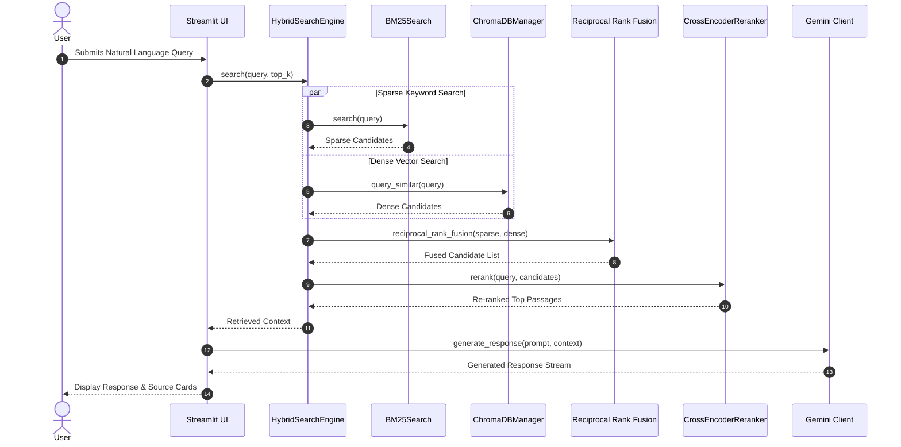

# Execution Flow Diagram

## Purpose
Provides a Mermaid sequence diagram detailing step-by-step query execution flow through the Hybrid RAG engine.

## Related Files
- [08 ML Pipeline](../08_ML_PIPELINE.md)
- [09 Streamlit Pages](../09_STREAMLIT_PAGES.md)

## Key Concepts
- **Hybrid RAG Sequence**: Parallel sparse BM25 and dense ChromaDB search, RRF fusion, Cross-Encoder reranking, and Gemini streaming synthesis.

## Content

## Next Reading
- [08 ML Pipeline](../08_ML_PIPELINE.md)
