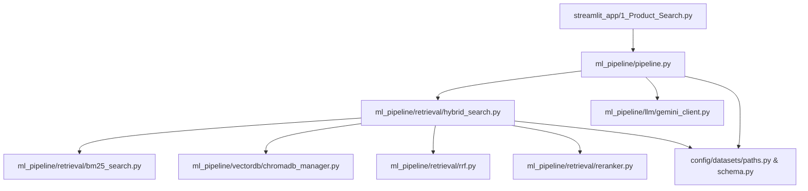

# Module Dependencies Graph

```mermaid
graph TD
    STREAMLIT[streamlit_app/1_Product_Search.py]
    ML_PIPE[ml_pipeline/pipeline.py]
    HYBRID[ml_pipeline/retrieval/hybrid_search.py]
    BM25[ml_pipeline/retrieval/bm25_search.py]
    CHROMA[ml_pipeline/vectordb/chromadb_manager.py]
    RRF[ml_pipeline/retrieval/rrf.py]
    RERANK[ml_pipeline/retrieval/reranker.py]
    GEMINI[ml_pipeline/llm/gemini_client.py]
    CONFIG[config/datasets/paths.py & schema.py]

    STREAMLIT --> ML_PIPE
    ML_PIPE --> HYBRID
    ML_PIPE --> GEMINI
    HYBRID --> BM25
    HYBRID --> CHROMA
    HYBRID --> RRF
    HYBRID --> RERANK
    ML_PIPE --> CONFIG
    HYBRID --> CONFIG
```
