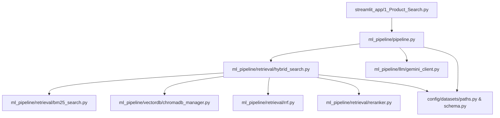

# Module Dependencies Diagram

## Purpose
Provides a Mermaid graph illustrating Python module dependencies across `streamlit_app/`, `ml_pipeline/`, and `config/`.

## Related Files
- [02 Repository Structure](../02_REPOSITORY_STRUCTURE.md)
- [08 ML Pipeline](../08_ML_PIPELINE.md)

## Key Concepts
- **Python Imports Graph**: Dependency relationships between UI pages, ML search components, vector DB managers, and dataset configuration files.

## Content

## Next Reading
- [02 Repository Structure](../02_REPOSITORY_STRUCTURE.md)
