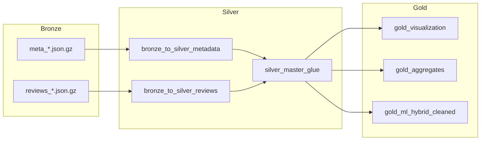

# Pipeline Diagram

## Purpose
Provides a Mermaid flowchart illustrating the Medallion Data Lake transformation flow.

## Related Files
- [04 Data Pipeline](../04_DATA_PIPELINE.md)
- [07 Glue Pipeline](../07_GLUE_PIPELINE.md)

## Key Concepts
- **Data Pipeline Progression**: Sequential transformation from raw JSON files to Silver cleaned master datasets to Gold analytical tables.

## Content

## Next Reading
- [04 Data Pipeline](../04_DATA_PIPELINE.md)
