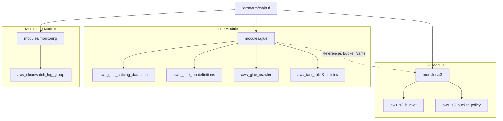

# Terraform Modules Diagram

## Purpose
Provides a Mermaid diagram illustrating the modular topology of Terraform infrastructure modules.

## Related Files
- [10 Terraform](../10_TERRAFORM.md)
- [06 AWS Infrastructure](../06_AWS_INFRASTRUCTURE.md)

## Key Concepts
- **Module Composition**: Root module (`terraform/main.tf`) composing child modules (`modules/s3`, `modules/glue`, `modules/monitoring`).

## Content

## Next Reading
- [10 Terraform](../10_TERRAFORM.md)
